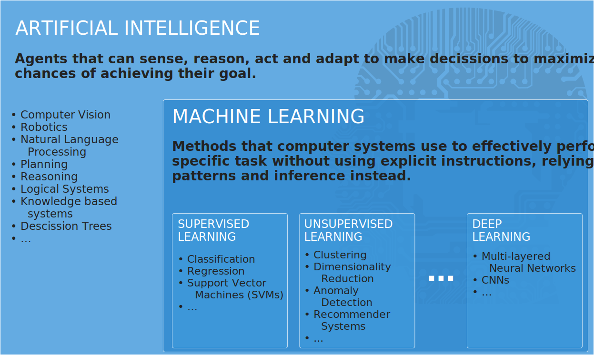
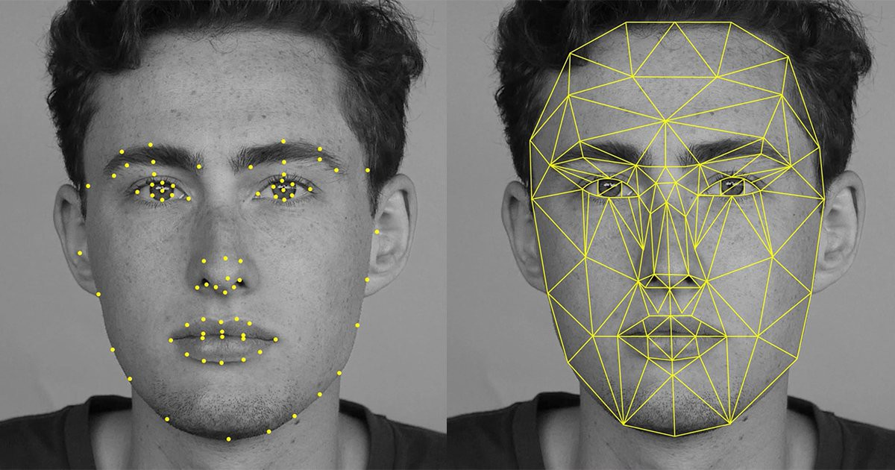
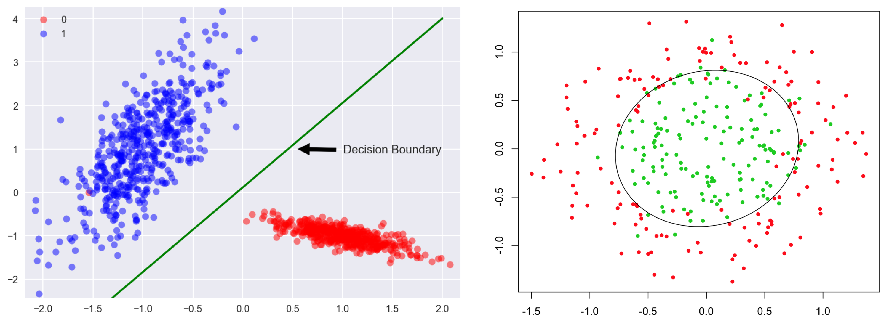
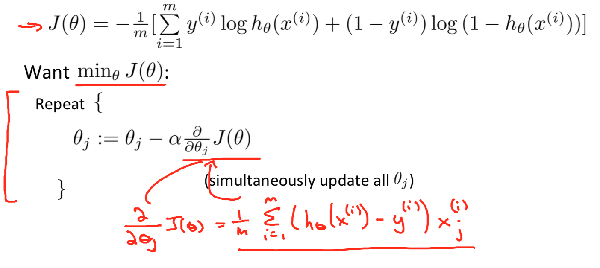
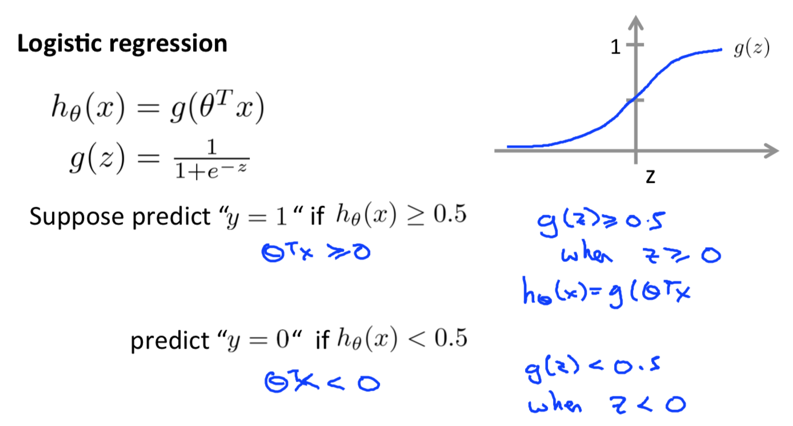
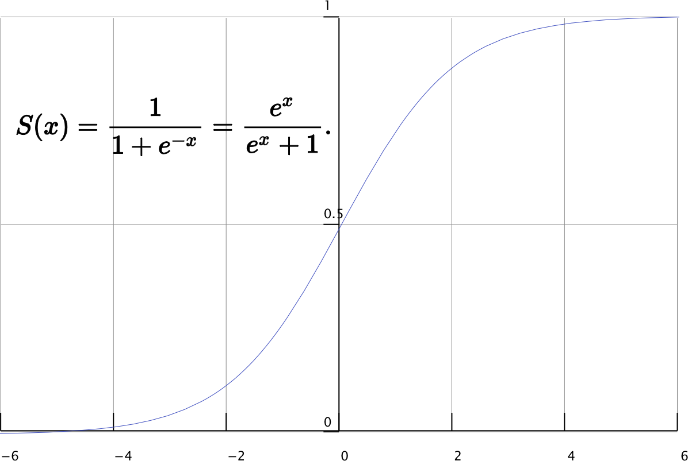
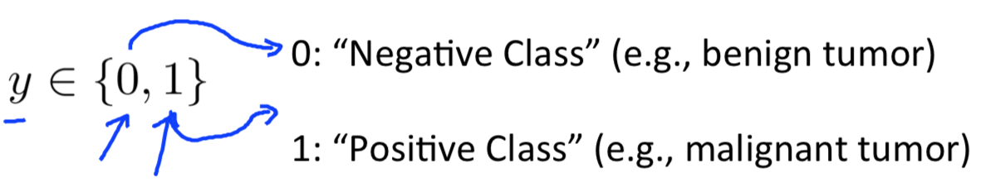
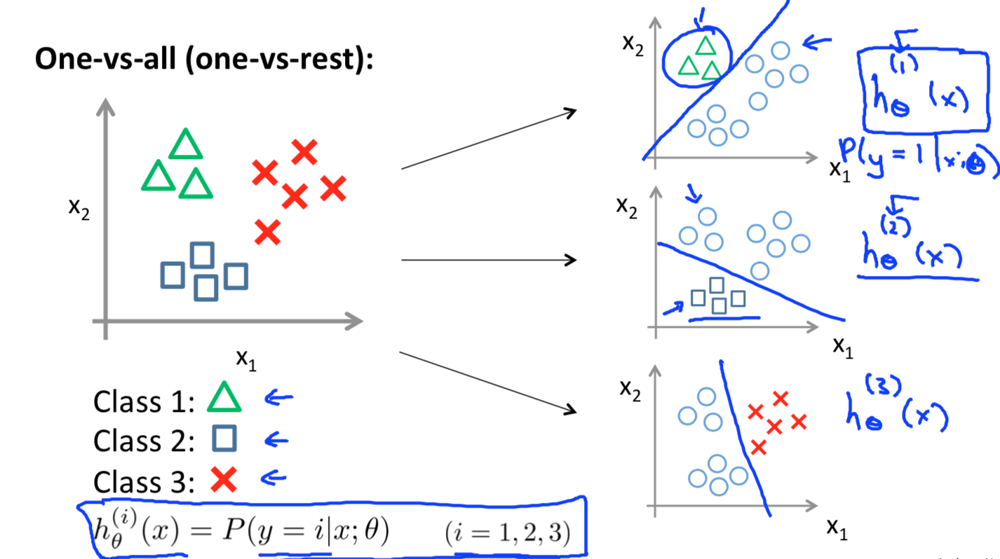

# Applied Machine Learning

### Player Look-a-like

 

Christian Treffs

---

## Player Look-a-like Use Case

Develop an app prototype 📱 that captures a selfie 🤳 and match it to a soccer player ⚽ using machine learning 🤖.    

Notes: Share your match 📸 via social media.

---

### Here we go...

- 7300 labeled player images

----

# 🤔

---

## What is machine learning?

----

Machine Learning is ...
> ... the field of study that gives computers the ability to learn without being explicitly programmed.

~ *Arthur Samuel (1959)*

----

> ... a well-posed learning problem:
> A computer program is said to learn from experience `E`
> with respect to some task `T` and some performance measure `P`,
> if its performance on `T`, as measured by `P`,
> improves with experience `E`.

~ *Tom Mitchell (1998)*

----

> ... the scientific study of algorithms and statistical models 
> that computer systems use to effectively perform a specific task 
> without using explicit instructions, relying on patterns and inference instead.    
<!-- > It is seen as a subset of artificial intelligence.-->

~ *Wikipedia (2019)*

----

# 🤯

----

Notes: 

Supervised: 
- function that maps an input to an output based on example input-output pairs.
- infers a function from labeled training data consisting of a set of training examples

Unsupervised:
- self-organization 
- a method of modelling the probability density of inputs

---

# 💡

Notes: Training and application of ML model

---

### Training

Notes:

- offline face detection chain

----

##### Facial Features

Notes: 
- face vector: 65 or 128 feature points
- OpenFace

----

### Detection

---

### Logistic Regression

* Classification
	- Email: Spam / Not Spam?
	- Online Transactions: Fraudulent Yes/No?
	- Tumor: Malignant/Benign?

Note: p 155, aka threshold classifier, decision boundary

----

#### Cost function & gradient descent

Note: algorithim looks identical to linear regression, there are optimizations i.e. Conjugate gradient, BFGS (Broyden-Fletcher–Goldfarb-Shanno), L-BFGS

----

#### Sigmoid function

----

##### Multi-class classification: one-vs-all

- Classification with multiple segments
	- Email tagging: Work, Friends, Family, Hobby
	- Medical diagrams: Not ill, Cold, Flu
	- Weather: Sunny, Cloudy, Rain, Snow

Note: p. 181, let classify two segments, then resegment again

---

# 📱 Demo

---

## 🙋🙋‍♂️ Questions?

