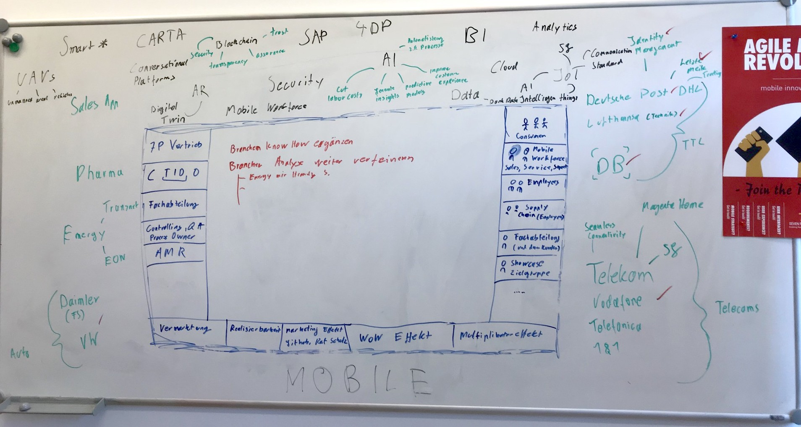

# Future of ...

### Innovation + Emerging Technologies

### Recap

---

#### Core-Team
- Andrea
- Andreas
- Chris
- Gregor
- Manu
- Michael
- Michaella
- Patrick

---

<https://confluence.7p-group.com/display/ASD/Emerging+Technology>

> jeder darf Ideen einbringen & Vorschläge machen

---

## 1. Märkte, Metriken & Brainstorming

- Erarbeiten von relevanten Themengebieten und neuen "Märkten"
- Erstellen einer Bewertungsmetrik für die Zukunft/Qualität von Ideen
- Erarbeiten initialer Ideen angelehnt an die 6-3-5 Brainwriting Methode

----

----

#### Generierte Ideen & Fragestellungen 

5G, Letzte Meile, AR, Digital Twins, Medikamenten Echtheitskontrolle, Machine Learning on Mobile, Smart Energy

---

## 2. Research

- Vertiefung und Einarbeitung in die Gebiete & Themen aus Phase 1.
- Präsentation der Ergebnisse
	- Michaella: Branchenanalyse
	- Patrick & Chris: Themen aus der vorherigen Session
- Problem: zu viele Leute, zu wenig Zeit, zu unkonkret
- neuer Ansatz: Pitches

---

## 3. Pitches

- Aus vorherig aufgebautem Wissen & Ideen kurze (max. 5min) Pitches für konkrete Anwendungen
- Manu & Chris pitchen an Andrea, Andreas, Michael & Gregor
- 20+ Pitches wurden vorgestellt

---

## 4. Selektion und Fokus

- In gemeinsamer Mattermost Gruppe wurde über die Pitches gevotet. 
- Pitches mit > 4 :thumbsup: werden fokusiert und prototypisch umgesetzt
- Aktuelle Phase
- Zusätzliche Ideen von extern (z.B. Haereus)

----

- 6: Multipeer-AR Baustelle
- 5: Digital Twin Packstation
- 4: ML Projekt Failure from Projekt Metrics
- 4: Digital Twin Fuhrparkflotte
- 3: Multipeer-AR/VR Schulung
- 3: ML-Audio-Maschienenprüfung
- 3: ML für Unfallerkennung + Prävention
- 2: Multipeer-AR Fußball
- 2: E-Learning Modul für die HTC Vive
- 2: Distraction Free Driving
- 2: DFL AR Torwandschießen
- 2: Cooptional Delivery

Notes:

- 1: ML Office Internetabdeckung
- 1: ML Krankheiten am Husten/Niesen erkennen
- 1: ML Frischeanalyse Obst & Gemüse
- 1: ML Flüssigmedikamente auf Echtheit prüfen
- 1: ML Automatisierte Angebotserstellung
- 1: Digital Twin Office Computer / Mobile Phones
- 1: Digital Twin Office
- 1: Digital Twin Meetings
- 1: Digital Twin Kühlschrank
- 1: Digital Twin Kaffeemaschine
- 1: DFL AR/VR Stadion
- 1: Closed-loop Analytics
- 1: Bring Your Own Compute

----

#### Multipeer-AR Baustelle

### Demo
(wenn Zeit)

---

## 5. Abschluss

- Am 26.4. haben wir mindestens zwei entwickelte Ideen

