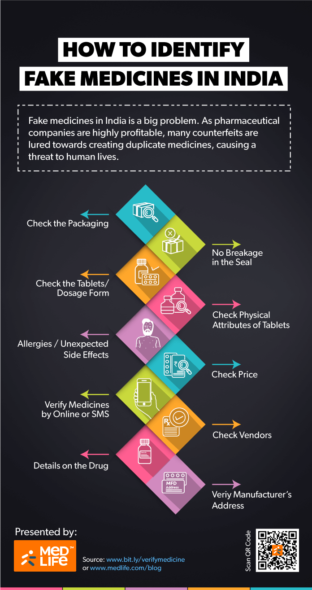
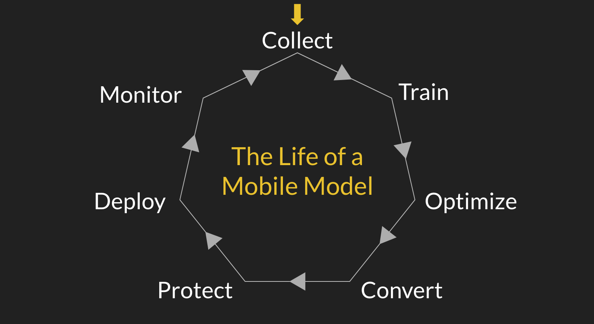
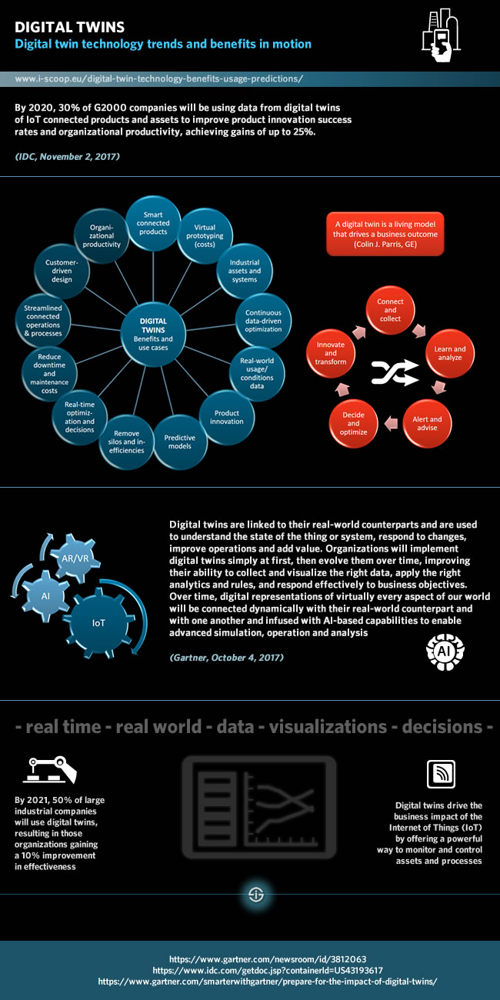
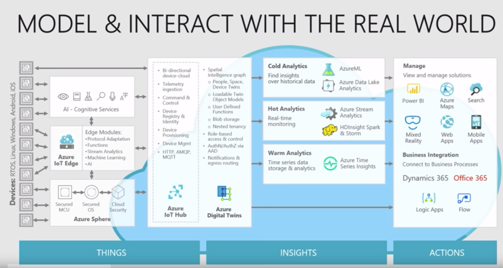
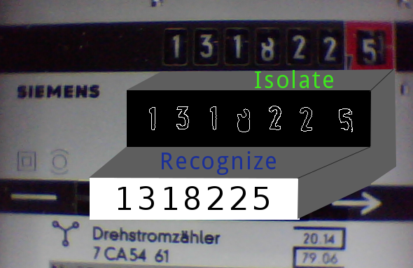

# Innovation Sprint

*19.03.2019*

Patrick Hoff & Christian Treffs

---

### Übersicht

1. Letzte Meile
2. 5G
3. Mobile Packstation
4. Medikamenten App
5. Medikamenten Echtheitskontrolle
6. Machine Learning on Mobile
7. Digital Twins
8. SmartEnergy

---

## Letzte Meile

+ Weg vom Paketzentrum zum Empfänger

#### Probleme:

+ Empfänger (bzw. Nachbarn) nicht zuhause um Paket entgegenzunehmen
+ => 2. oder gar 3. erfolgsloser Zustellversuch
+ Hermes schätzt: **Hälfte** der Zustellkosten entfallen auf letzte Meile

----

#### Ideen:

+ Packstation
+ Crowd Delivery
+ Drohnen / Roboter
+ Routenplanungsoptimierung
+ letze Meile als Premiumservice
+ Gamification?
+ letzte Meile nicht Kernkompetenz => Entkoppelung?

----

#### Kritik:

+ nur Händler (Versender) im Blick nicht Empfänger
+ Geschäftsmodell: Zufriedenheit der Händler (Kosten, Effizienz)
+ => Kosten auf letzer Meile senken (Paketstation, Roboter, Drohnen)
+ Eigentlicher Kunde: Empfänger

----

#### Empfänger-Wünsche:

+ digital in den Zustellprozess eingreifen
+ garantierte persönliche Zustellung durch Zeitfensterangabe
+ Mitnahme von Retouren
+ Pakete gebündelt am Samstagvormittag

----

### "Interaktive" letzte Meile?

----

#### Links:

+ <https://www.zeit.de/zeit-wissen/2018/06/digitalisierung-probleme-logistik-internet-unterschiede-stadt-land>
+ <https://www.dvz.de/rubriken/logistik/detail/news/letzte-meile-ohne-dhl-co.html>
+ <https://www.biek.de/download.html?getfile=1928>
+ <https://newsroom.hermesworld.com/trend-crowd-delivery-chancen-und-risiken-des-sharing-economy-modells-14993/>

---

## 5G

#### Fakten:

+ Datenrate: 100 Mbit/s (4G) => 20 Gbit/s (Ø = 100 Mbit/s bzw. 1 Gbit/s (hotspot))
+ Latenz: 10 - 70 ms (4G) => <1 ms
+ Frequenzbereiche: <6 GHz, >20 GHz
+ Abwärtskompabilität auf 4G
+ Echtzeitübertragung: 100 Milliarden Geräte gleichzeitig ansprechbar
+ Energieverbrauchkostensenkung: 1/1000 pro Bit, 1/10 je Mobildienst

----

#### Erwartungen / potentielle Entwicklungen:

+ vorerst regionaler, industrieller Einsatz + Städte
+ Flächenausbau vorerst LTE
+ Konkurrenz für bestehende Breitbandanschlüsse?
+ erschwingliche / massentaugliche Daten-Flats?

----

### Impact:

#### Cloud computing:

+ cloud robotics (processing in cloud -> cheaper machines)
+ connected traffic cloud: operational decision making

----

#### AR / VR:

+ AR wayfinding (ÖPNV)
+ assist or train service technicians
+ VR shopping mobil
+ AR shopping im Geschäft
+ mobiles AR/VR product setting visualization

----

#### Audio/Video:

+ mobiles 4K Streaming/VOD/TV
+ 3D broadcasts
+ 4K, 360° shopping
+ realtime Audio

----

#### Remote:

+ monitoring, controlling
+ advanced metering infrastructure
+ predictive maintenance
+ quality inspection/diagnostic

----

#### Smart:

+ autonome Fahrzeuge
+ smart objects

----

#### Links:

+ <https://files.vogel.de/vogelonline/vogelonline/files/9763.pdf>
+ <https://en.wikipedia.org/wiki/5G>
+ <https://www.n-tv.de/technik/Wird-Deutschland-mit-5G-Masten-gespickt-article20854045.html>

---

## Mobile Packstation

---

## Medikamenten App

> Medikamenten Scanner: App sagt was Nebenwirkungen sind & empfielt was nicht zusammen genommen werden kann

----

#### Apps

* [PGXperts Interaktions Check](https://www.hmg-systems-engineering.com/pgxperts-platform2/)
* [PocketPharmacist](https://www.pocketpharmacist.io/)
* [Drugs.com](https://www.drugs.com/drug_interactions.php) 
* [Dosecase](https://www.montunosoftware.com/features)
* [MyMeds](https://www.my-meds.com)
* [MedHelper App](http://medhelperapp.com)

#### Portale: 
- <https://www.psiac.de> (7 Tage kostenlos)
- <https://www.pharmawiki.ch> (kostenlos)

Notes:
PGX
		- Medikamenteninteraktionschecker Datenbank
PocketPharmacist:
	- Hat Medikamenteninteraktion, Medikamentendatenbank
	- INTERACTION CHECKER
	- DRUG INFORMATION
	- MEDICATION BOX
	- DRUG QUIZZES
Drugs:
	- Interaction Checker App  

Überall Medical Disclaimer

----

#### Quellen

- <https://www.dr-hempel-network.com/digital-health-technolgy/top-10-mobile-apps-in-medication-management/>

---

## Medikamenten Echtheitskontrolle

> - Medikamenten Echtheitskontrolle & Herstellungsporzessgarantie (z.B. Blockchain)   
> - Barcode/Seriennummerscanner   
> - Verbraucher Hinweise ("oft gefälscht")   
> - Global   
> - Fotovergleich      
> - Unabhängig & Datenschutz konform

----

##### Chkfake App

- Fake Checker für den indischen Markt
- Nicht eingeschränkt auf Medikamente

<iframe width="560" height="315" src="https://www.youtube.com/embed/0LORzF9bs4E?start=5" frameborder="0" allow="accelerometer; autoplay; encrypted-media; gyroscope; picture-in-picture" allowfullscreen></iframe>

<https://www.chkfake.com/>

Notes:
<https://itunes.apple.com/in/app/chkfake/id1211989947?mt=8>

----

----

#### Schreiner Medipharm - BitSecure

- small, randomly-generated high-resolution pattern that is able to be instantly authenticated via consumers’ mobile app.
- If the medication is counterfeit, the image’s quality will deteriorate 
	
<https://www.schreiner-group.com/en/closure-seal/bitsecure.html>

Note:
- The digital security feature BitSecure enables reliable authentication. BitSecure uses a high-resolution random pattern. Its delicate details are not discernible by the naked eye. If a counterfeiter copies the pattern details are lost compared with the original. The reason is that the original print is produced from a high-resolution digital master whereas an illegal copy is based on a previously printed image. The quantity of the resulting loss of detail can be determined by means of a smartphone app or a handheld reader. Copies can thus be reliably distinguished from originals.
- Copies can thus be reliably distinguished from originals.

----

##### Medlife - Verify Medicines

Online or SMS:
- PharmaSecure is working with manufacturers to protect against counterfeits. Unique Identification Code along with a barcode is printed on medicine packages or strips. Consumers can send the unique “Authentication code” by SMS to 9901099010 to receive an authentication message from the pharmaceutical manufacturer to confirm the authenticity of the drug being purchased.

Notes:

Online Check:

Go to PharmaSecure website.
Select your country.
Enter your Mobile Number and the “Authentication Code” printed on the medicine strips.
Enter word verification and hit “VERIFY” button. 
That is it… Once done, you will get an SMS with result.

The Authentication code is different from the Batch Number.
The Authentication code may not be available on all medicines, except for some expensive medicines.

----

### Quellen

- <https://www.psfk.com/2018/09/bitsecure-mobile-pharmaceutical-authentication-app.html>
- <https://www.neue-verpackung.de/47184/sicherheit-fuer-jedes-individuelle-produkt-faelschungssicherheit-und-serialisierung/>
- <https://www.schreiner-group.com/de/verschlusssiegel/bitsecure.html>
- <https://www.elektroniknet.de/elektronik/elektronikfertigung/etiketten-per-laser-beschriften-152048.html>
- <https://www.medlife.com/blog/10-ways-check-fake-medicines/>

---

### Machine Learning on Mobile

> CoreML & Mobile   
> Bildverarbeitung   
> Privacy   
> Data Collection/Classification auf Edge Devices   
> DSGVO

----

#### Lifecycle

In App: 

Train new model -or- Use pre-trained model

----

### Gründe für ML on Mobile

- Genauigkeit
- Verfügbarkeit
- Kosten
- Unmittelbarkeit
- Leistung
- Datenschutz
- Nutzerspezifisch

Notes:
- Genauigkeit: Modelle können auf individuelle Nutzerdaten auf individuellen Geräten zugeschnitten werden
- Verfügbarkeit: Wenig- oder keiner Internetverbindung, Hohes Daten-Übertragungsvolumen
- Kosten: Alles was auf dem Gerät passieren kann spart Geld. Server zu betreiben ist teuer.
- Unmittelbarkeit: Berücksichtigen von Daten, Produkten oder Informationen sobald sie verfügbar sind. Es ist einfach das Model kontinuierlich mit neuen Trainingsdaten zu aktualisieren.
- Leistung: geringe Latenz/Verzögerung, Echtzeitfähigkeit
- Datenschutz: Daten müssen das Gerät nie verlassen, was Vernetzen und Compliance deutlich einfacher macht.
- Nutzerspezifisch: die App kann vom Nutzer und seinem Verhalten direkt lernen.

----

### Beispiele für ML on Mobile

- Aktvitätserkennung (z.B. Raise-to-wake)
- Biometrischeserkennung & -verifikation (z.B. FaceID, TouchID)
- Orientierungspunkte erkennung (Indoor-Navigation)
- Optical character recognition (OCR) / Handschrifterkennung
- Personalisierte Gesprächsmodelle & Smart Reply
- Erkennung von verdächtigen Aktivitäten
- Voice/Speech recognition, Text to speech
- Personalisierte Werbung, Predictive analytics & Empfehlungen

Notes: 
- Raise to wake apple watch
- OCR: z.B. Chinesische zeichen
- Recommendations: Shopping recommendations on ecommerce apps
Außerdem:
- Filtern: Email & Foren
- Hilfe für Menschen mit Behinderung
- Bilderkennung & -labeling
- Predictive Keyboard
- Zuverlässiges Code Scanning
- Segmentierung
- Pose estimation
-  (z.B. "Hey Siri")

----

#### Use Cases - Creativity

<iframe width="560" height="315" src="https://www.youtube.com/embed/xky0NoxronY" frameborder="0" allow="accelerometer; autoplay; encrypted-media; gyroscope; picture-in-picture" allowfullscreen></iframe>

- [GIF Maker by Momento](https://itunes.apple.com/app/apple-store/id1172709468?mt=8)
- [Prisma](https://prisma-ai.com/)
- [Panda](https://itunes.apple.com/us/app/panda/id1250583288?ls=1&mt=8s)
- [Meitu](http://global.meitu.com/en/products)

Notes: 
- GIF Maker by Momento: They use image segmentation in real-time to blend AR effects around people in scenes. On-device makes the real-time part of this viable.
- Prisma: Artistic style transfer (there are a bunch of apps like this).
- Panda:  AR masks like Snapchat, but with the added ability to hear words via speech recognition. Effects are triggered when words are spoken.
- Meitu: Uses on-device ML to power a number of real-time beautification features

----

#### Use Cases - Core UI / UX

<iframe width="560" height="315" src="https://www.youtube.com/embed/MD61bddZtbg?start=23" frameborder="0" allow="accelerometer; autoplay; encrypted-media; gyroscope; picture-in-picture" allowfullscreen></iframe>
<!--<iframe width="560" height="315" src="https://www.youtube.com/embed/2zePk6IjWZg" frameborder="0" allow="accelerometer; autoplay; encrypted-media; gyroscope; picture-in-picture" allowfullscreen></iframe>-->

- [Superimpose X](https://itunes.apple.com/us/app/superimpose-x/id1304177471)
- [Homecourt](https://itunes.apple.com/app/apple-store/id1258520424?mt=8)
- [PlantVillage](https://plantvillage.psu.edu/)
- Subreddit Suggester
- Polarr

Notes:

— Superimpose X: Also uses image segmentation to power an auto-masking tool, so users don’t have to cut out people by hand.
- Subreddit Suggester — An example that uses Create ML to train a model that automatically pics a subreddit from your post title so you don’t have to click so many buttons to submit a new post.
- Homecourt:  Featured on stage at the latest Apple iPhone event. Uses pose detection and some other ML models to automatically track analytics for basketball. I think we’ll see apps like this pop up for many sports.
- PlantVillage, trained a neural network that can detect different types of crop diseases impacting places in east Africa. Farmers don’t have great connectivity, though, and data costs are very expensive. The solution was to put the model in the app and run it on-device.
- Polarr:  — Uses on-device ML to help with photo composition, editing, and organization in real-time.
- - Facebook has said they ship their own run time in every FB app bundle. They use models to do everything from fine tuning newsfeed rankings on-device to analyzing photos.

----

#### Use Cases - Privacy & Health

<iframe width="560" height="315" src="https://www.youtube.com/embed/fo3joCLxfAw" frameborder="0" allow="accelerometer; autoplay; encrypted-media; gyroscope; picture-in-picture" allowfullscreen></iframe>

- FaceID
- MDAcne, tracks skin health over time with computer vision algorithms running right on the phone.

----

### Framworks / Tools

- [TensorFlow Mobile/Lite](https://www.tensorflow.org/lite)
- Firebase ML Kit
- Core ML / Create ML
- Fritz Mobile SDK / Fritz.ai
- Google Cloud AutoML
- Clarifai Mobile SDK
- Amazon Rekognition, Polly, Lex
- Microsoft Azure Cognitive Services
- IBM Watson
- Caffe2Go
- ...

Notes:

- Turi Create
- Keras
- QNNPACK
- ONNX
- Cloud bases web-services (-> then use pretrained model)

- <https://github.com/akirasosa/mobile-semantic-segmentation>
- <https://vuforia.com/engine>

----

#### Sources

- <https://heartbeat.fritz.ai/machine-learning-on-mobile-devices-3-steps-for-deploying-it-in-your-apps-48a0a24364a8>
- <https://heartbeat.fritz.ai/embracing-machine-learning-as-a-mobile-developer-4ebcda58d4ac>
- <https://heartbeat.fritz.ai/machine-learning-models-on-the-edge-mobile-and-iot-8a5384a370ba>
- <https://heartbeat.fritz.ai/the-lifecycle-of-mobile-machine-learning-models-759bff75ec3f>
- <https://machinethink.net/blog/training-on-device/>
- <https://machinethink.net/blog/machine-learning-device-or-cloud/>
- <https://heartbeat.fritz.ai/from-ai-enabled-to-ai-first-the-changing-mobile-landscape-308fb0e5adfc>
- <https://medium.com/coding-blocks/google-lens-firebase-54d34d7e1505>
- <https://heartbeat.fritz.ai/building-pokédex-in-android-using-tensorflow-lite-and-firebase-cc780848395>
- <https://msdn.microsoft.com/en-us/magazine/mt814802.aspx>
- <https://blog.algorithmia.com/machine-learning-and-mobile-deploying-models-on-the-edge/>
- <https://theappsolutions.com/blog/development/machine-learning-in-mobile-app/>
- <https://www.netguru.com/blog/machine-learning-on-mobile-core-ml-and-tensorflowlite-frameworks-comparison>
- <https://seventablets.com/blog/how-are-developers-using-machine-learning-for-mobile-apps/>
- <https://heartbeat.fritz.ai/machine-learning-on-ios-and-android-bd77f6e92c7b>
- <https://codeburst.io/ios-ml-kit-advantages-of-machine-learning-in-your-pocket-4ea39fc8282c>

---

### Digital Twins

> Digital Twin Visualisierung via AR -> Kaffee Partner   
> - 3D Scan von Object     
> - Objekt erkennen (AI)      
> -> aggregieren zu gesamt Unternehmensbild

----

#### Digital Twin / Device shadow

> A digital twin is a digital replica of a living or non-living physical entity. By bridging the physical and the virtual world, data is transmitted seamlessly allowing the virtual entity to exist simultaneously with the physical entity. Digital twin refers to a digital replica of physical assets (physical twin), processes, people, places, systems and devices that can be used for various purposes.

Notes:
Digital twins will be a disrupter for many industries and will radically change business models. Ultimately, capitalizing the power of IoT and data regarding things, services, people, and networks, digital twins will change how businesses create, simulate, perform, predict, and self-heal.
<https://www.digitalistmag.com/iot/2018/05/23/will-there-be-digital-twin-for-everything-everyone-06169041>

----

#### Beispiele

- [Turbinen (mit Voice Interaktion & MR (GE Digital)](https://www.youtube.com/watch?v=2dCz3oL2rTw)
- [Jet Engines: IBM Watson IoT](https://youtu.be/RaOejcczPas?t=109)
- Lokomotiven
- [Architektur / Gebäude](https://youtu.be/RaOejcczPas?t=393)
- [Windturbinen](https://www.youtube.com/watch?v=OcnGVR4zVGo)
- Monitoring, Diagnose, Prognose, Performance
- Intelligent Maintenance Systems
- Smart Manufacturing
- [Health care products](https://irsweb.it/pdf/Embedded_Digital%20Twin_v2.pdf)
- [Naturschutz/Artenschutz](https://www.youtube.com/watch?v=vi04SLCF52s)
- [Traffic Simulation](https://www.researchgate.net/publication/324194968_Simulation-based_Identification_of_Critical_Scenarios_for_Cooperative_and_Automated_Vehicles)

Notes:
- "Digital companions of physics objects" -> Sensor data from physical object updates digital twin object
- Things
- People
- Services
- Networks
- [Creating Buildings digital twin](https://www.ibm.com/blogs/internet-of-things/creating-buildings-digital-twin/)
- IBM IoT: <https://www.ibm.com/internet-of-things/explore-iot/buildings>

----

#### Minds + Machines: Meet A Digital Twin

<iframe width="560" height="315" src="https://www.youtube.com/embed/2dCz3oL2rTw?start=48" frameborder="0" allow="accelerometer; autoplay; encrypted-media; gyroscope; picture-in-picture" allowfullscreen></iframe>

----

----

#### Anwendungen / Tools

#### Virtual Car - VW

<iframe width="560" height="315" src="https://www.youtube.com/embed/djCzSKdUbMc?start=1196" frameborder="0" allow="accelerometer; autoplay; encrypted-media; gyroscope; picture-in-picture" allowfullscreen></iframe>

[Artikel](https://www.volkswagenag.com/de/news/stories/2017/03/how-volkswagen-is-developing-the-car-of-the-future-virtually.html)

----

#### Swim AI

Live Traffic Online:

<https://www.swim.ai/showcase/traffic/>

----

### Azure Digital Twins Service

<iframe width="560" height="315" src="https://www.youtube.com/embed/TvN_NxpgyzQ?start=285" frameborder="0" allow="accelerometer; autoplay; encrypted-media; gyroscope; picture-in-picture" allowfullscreen></iframe>

- <https://www.youtube.com/watch?v=TvN_NxpgyzQ> 
- <https://azure.microsoft.com/en-us/services/digital-twins/> 

----

 
----
 
### Software AG (Darmstadt)

<iframe width="560" height="315" src="https://www.youtube.com/embed/CodiKhUxGUs?start=44" frameborder="0" allow="accelerometer; autoplay; encrypted-media; gyroscope; picture-in-picture" allowfullscreen></iframe>

ENTERPRISE DIGITAL TWIN: INNOVATING EXCELLENCE   
[DT @ Software AG](https://www.softwareag.com/corporate/innovation/enterprise_digital_twin/default.html)

----

#### Campana & Schott (Frankfurt am Main)

<iframe width="560" height="315" src="https://www.youtube.com/embed/hR0kt_qXeos" frameborder="0" allow="accelerometer; autoplay; encrypted-media; gyroscope; picture-in-picture" allowfullscreen></iframe>

----

### WorldInsight (DB Immersive Technology - EVE_DBS)

EVE Studio VR/MR creator suite

<iframe width="560" height="315" src="https://www.youtube.com/embed/90r4UJGN2_4" frameborder="0" allow="accelerometer; autoplay; encrypted-media; gyroscope; picture-in-picture" allowfullscreen></iframe>

<https://digitalspirit.dbsystel.de/die-wirklichkeit-zum-greifen-nahe/>

Notes:
- visualization tool with unique features to display high quality & large scale 3D models 
- easy real-time navigation
- visualize planning assets in 3D to enable better decisions and communication

----

### Meetup

Mittwoch, 23. Mai 2018
18:00 bis 21:00 <https://www.meetup.com/de-DE/IoT-Hessen/events/248886802/>

----

## 3D Scanning & Asset management

- <https://www.instructables.com/id/3d-Scan-Anything-Using-Just-a-Camera/>
- <https://www.aniwaa.com/best-3d-scanning-apps-smartphones/>
- [Scandy Pro](https://www.youtube.com/watch?v=0W-ctEGClSM)
- [Sanning 3d Object with iOS App](https://itunes.apple.com/us/app/scandy-pro/id1388028223?ls=1&mt=8)
- <https://www.youtube.com/watch?v=YizMalWigkI>
- <https://www.youtube.com/watch?v=hrkkMzDUtvE>

----

#### Sources

- <https://www.allerin.com/blog/applications-of-digital-twin>
- <https://twitter.com/EVE_DBS/status/1103301618408308737>
- <https://digitalspirit.dbsystel.de/>
- <https://www.produktion.de/smartproducts/warum-dem-verfahren-digital-twins-die-zukunft-gehoert-223.html>

---

### SmartEngergy

> * Consumer App um dynamisch & in Echtzeit Stromverbrauch im Haushalt zu messen und den Stromtarif anzupassen   
> * ML für Stromverbrauch zuhause   
> * Smart Netz "Retrofit"   
> * Urlaubsschaltung  
> * Smart Energy im Smart Home über AI + Analytics  
> Management, Niedrigernergiehaus, Umwelthipster	
----

#### Smappee

<iframe width="560" height="315" src="https://www.youtube.com/embed/GCUiI9fyFds?start=355" frameborder="0" allow="accelerometer; autoplay; encrypted-media; gyroscope; picture-in-picture" allowfullscreen></iframe>

<https://www.smappee.com/de/homepage>
[Smappee Energy Monitor 2.0](https://itunes.apple.com/us/app/smappee-energy-monitor-2-0/id1333084968)
- Echtzeitproduktion und -verbrauch.
- Strom, Solar, Gas und Wasser analysieren.

----

##### Sense 

<iframe width="560" height="315" src="https://www.youtube.com/embed/9B19zg92a3I" frameborder="0" allow="accelerometer; autoplay; encrypted-media; gyroscope; picture-in-picture" allowfullscreen></iframe>

<https://youtu.be/zIjzH7_c82o?t=98>
<https://sense.com/product.html>
<https://itunes.apple.com/de/app/sense-home-energy-monitor/id1024626982?mt=8&ign-mpt=uo%3D4>

Notes:
- <https://www.youtube.com/sense>
- <https://www.youtube.com/watch?v=9B19zg92a3I>
- <https://www.youtube.com/watch?v=ZTslnxmxreY>

----

##### Apps

* [Energy Cost Calculator](https://itunes.apple.com/us/app/energy-cost-calculator/id531132387?mt=8)
* [Energy Consumption Analyzer](https://play.google.com/store/apps/details?id=at.topfen.ecas&hl=en_GB)
* <https://ihaus.com/en/app/electric-meter>
* <https://smallbiztrends.com/2017/08/mobile-apps-to-help-you-reduce-energy-costs.html>

----

#### Volkszähler

ist ein freies Smart Meter im Selbstbau.
Der Nutzer behält dabei die vollständige Kontrolle über die anfallenden Strom, Wasser & Gaskosten.
<https://volkszaehler.org/>

Notes:
 Raspberry Pi
 
----

### OCR for den Stromzähler

<https://www.kompf.de/cplus/emeocv.html>
<https://github.com/skaringa/emeocv>

---

### Danke fürs Zuhören

### Fragen?

