# Machine Learning

### an introduction

 

Christian Treffs

Note: My notes

---

## What is machine learning?

### Definition
----

Machine Learning is ...
> ...field of study that gives computers the ability to learn without being explicitly programmed.

~ *Arthur Samuel (1959)*

----

> ... a well-posed learning problem:
> A computer program is said to learn from experience `E`
> with respect to some task `T` and some performance measure `P`,
> if its performance on `T`, as measured by `P`,
> improves with experience `E`.

~ *Tom Mitchell (1998)*

----

> ... is the scientific study of algorithms and statistical models 
> that computer systems use to effectively perform a specific task 
> without using explicit instructions, relying on patterns and inference instead.    
> It is seen as a subset of artificial intelligence.

~ *Wikipedia*

---

#### Machine learning fields

##### Supervised learning (classification, regression)

* Linear/Polinomial & Logistic regression
* Neural networks (Forward-/Backpropagation)
* Support-Vector Machines (SVMs)   

##### Unsupervised learning

* Clustering (k-Means)
* Dimensionality reduction (Principal Component Analysis (PCA))
* Anomality detection
* Recommender Systems

Note: not Structured prediction, Reinforcement learning

---

### Supervised Learning

> ... is the ML task of learning a function that maps an input to an output based on example input-output pairs.   
> It infers a function from labeled training data consisting of a set of training examples.

----

### Linear/Polinomial Regression

- Housing price prediction 
	- linear: size feet => price $
	- polynomial: (size feet, num rooms, num floors, age of home, ...) => price $

----

#### Linear regression

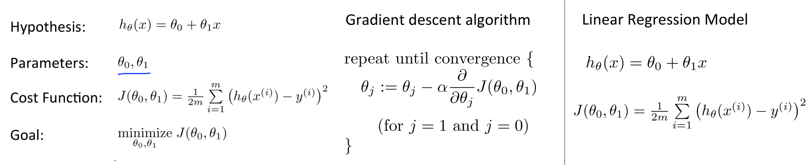

* training set -> learning algorithm -> cost-function w/ hypothesis -> estimation/prediction
* Idea: find $\theta$s to minimize cost-function
* Learning rate $\alpha$ -> adjust to tune gradient descent

Note: linear with one == univarite, Theta, for each data input (feature) -> one known output (target/prediction) in training set

----

#### Gradient descent & Learning Rate $\alpha$

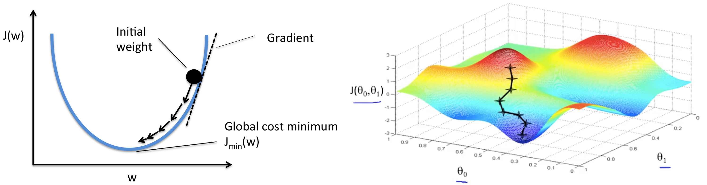

- Learning rate $alpha$ 
	- too small: slow convergence
	- too large: $J(\theta)$ may not descrease every iteration; may not converge
- Converged: if $J(\theta)$ decreases by less than $10^{-3}$ in 1 iteration

Note: - aka Batch-Gradient descent: each step of gradient descent uses all the training examples. 
	   - As we approach a local  minimum, gradient  descent will automatically  take smaller steps. No need to decrease $\alpha$ over time.
	   - Needs feature scaling - get every feature into $-1 ≤ x_i ≤ 1$ range -> Mean normalization.
	   - Gradient descent can converge to a local minimum, even with the learning rate $\alpha$ fixed

----

#### Technique: Feature Scaling

- Make sure features are on a similar scale 
- Get every feature into approximately $-1 ≤ x_i ≤ 1$ range.
- Mean normalization: 
	- replace $x_i$ with $x_i-µ_i$ to make features have approx. 0 mean

Note: do not apply to $x_0 = 1$

----

#### Gradient Descent alternative: Normal equation

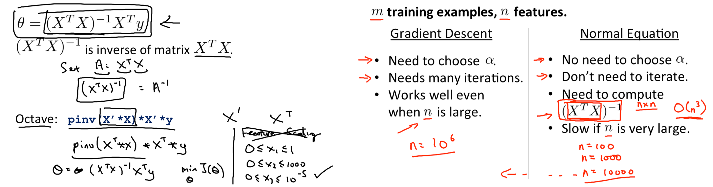

- = Method to solve for $\alpha$ analytically
- `+` more efficient
- `-` consumes more memory

---

### Logistic Regression

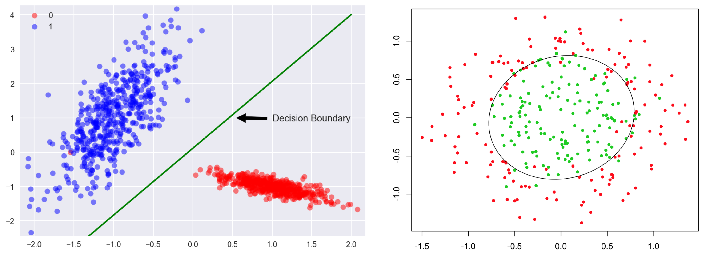

* Classification
	- Email: Spam / Not Spam?
	- Online Transactions: Fraudulent Yes/No?
	- Tumor: Malignant/Benign?

Note: p 155, aka threshold classifier, decision boundary

----

#### Sigmoid function

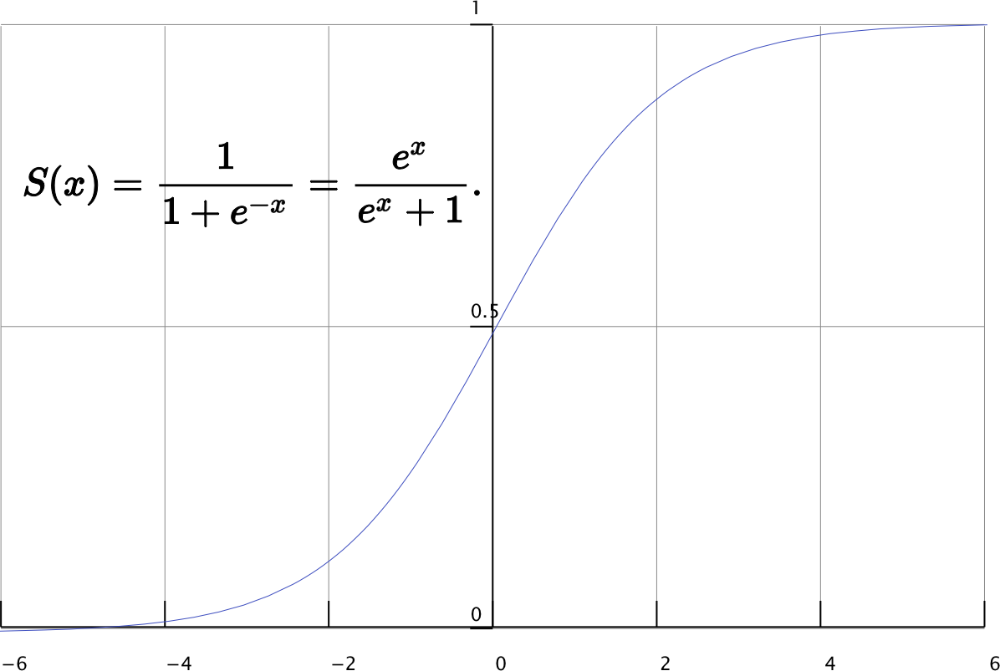

----

#### Cost function & gradient descent

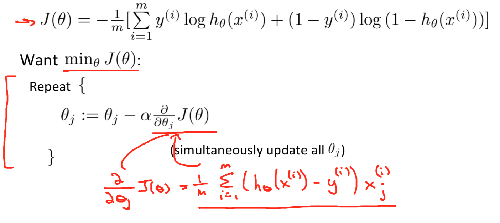
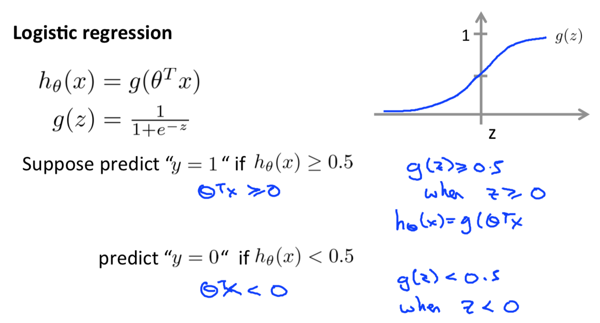
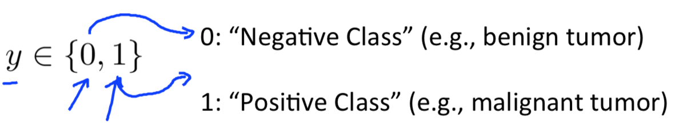

Note: algorithim looks identical to linear regression, there are optimizations i.e. Conjugate gradient, BFGS (Broyden-Fletcher–Goldfarb-Shanno), L-BFGS

----

##### Multi-class classification: one-vs-all

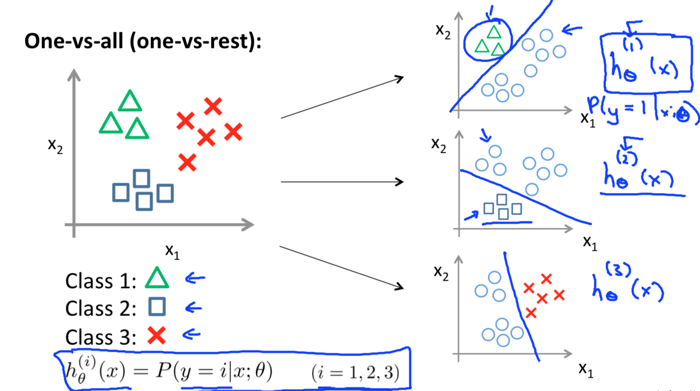

- Classification with multiple segments
	- Email foldering/tagging: Work, Friends, Family, Hobby
	- Medical diagrams: Not ill, Cold, Flu
	- Weather: Sunny, Cloudy, Rain, Snow

Note: p. 181, let classify two segments, then resegment again

----

### Regularization

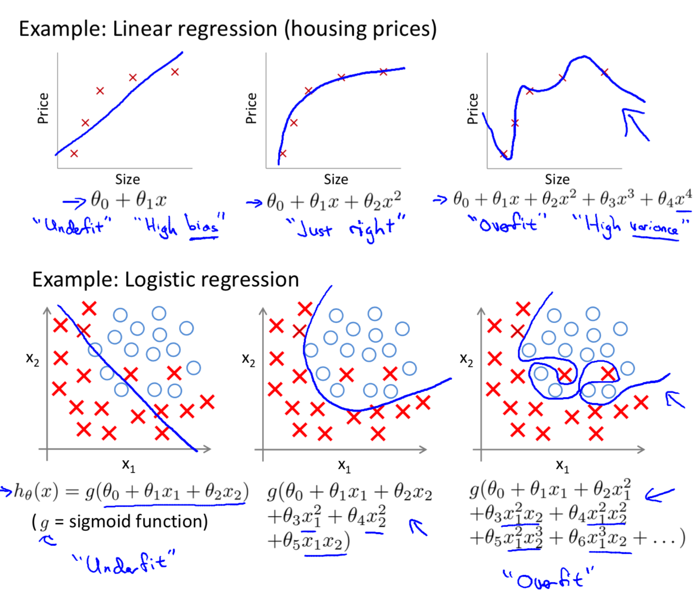

- bias vs. variance
	- high bias - underfit
	- high variance - overfit
- to address overfitting: 
	- reduce features
	- regularization

Note: p. 187, 
- regularization: Keep all features, but reduce magnitude/values of $\theta_j$ parameters 
- regularized linear regression p.199
- regularized logistic regression p.206

----

##### Regularized linear regression

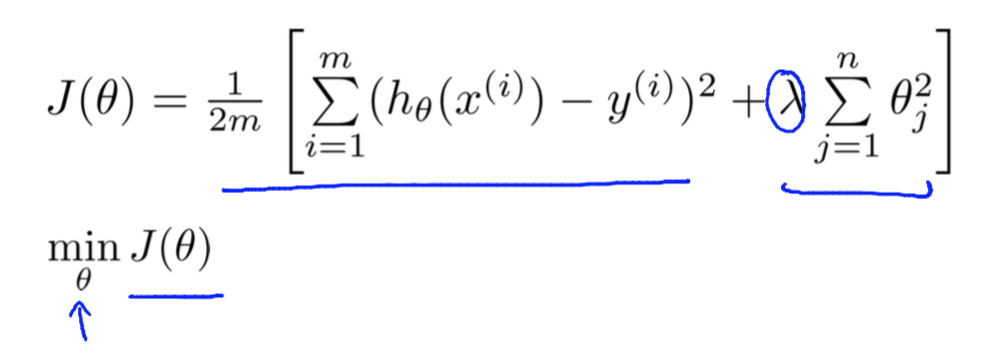

##### Regularized logistic regression

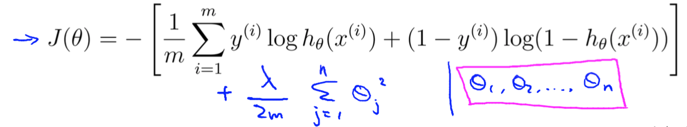

Note: $\lambda$ = regulariztion parameter; $\lambda$ too high => underfitting; $\lambda$ too small => overfitting

---

<!-- NEURAL NETWORKS -->

### Neural Networks

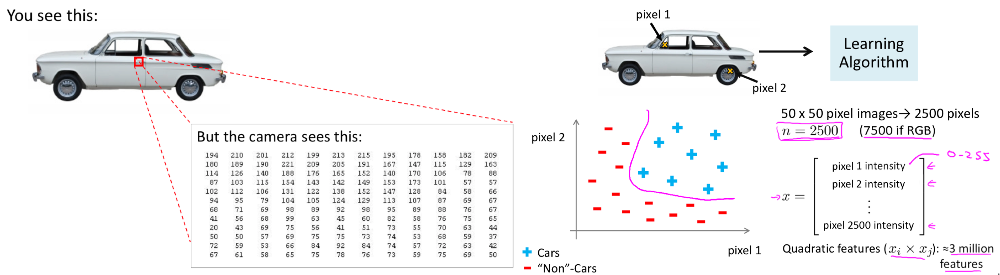

----

#### Neural network structure

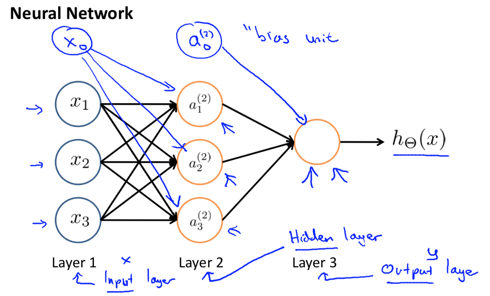

- $\alpha_i^{(j)}$ “activation” of unit $i$ in layer $j$
- non-liner hypotheses
- computer vision: car detection (car / not a car)
- Autonomous   driving  

Note: neurons and the brain

----

#### Neural Network activation

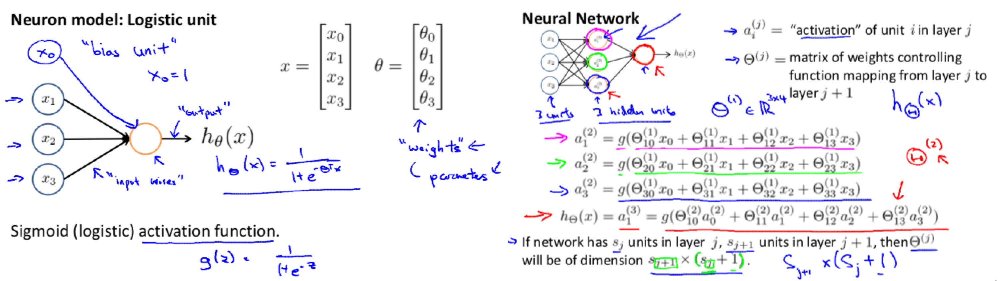

----

# Demo

- AND / OR

Note: p. 237

----

#### Multiple output neural network

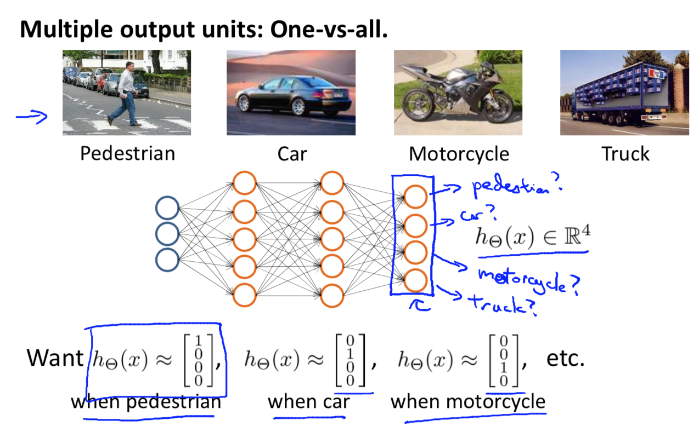

----

#### Cost function neural network

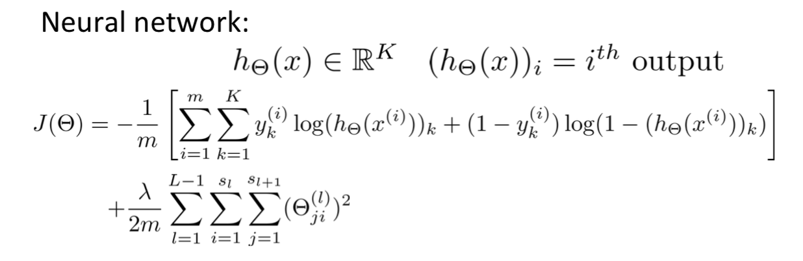

----

#### Training Neural Network: Forward & Back-propagation

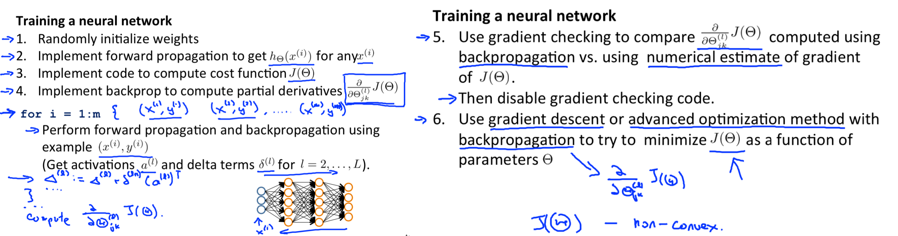

Note: p .256, The basic learning that has to be done in neural networks is training neurons when to get activated. Each neuron should activate only for particular type of inputs and not all inputs. Therefore, by propagating forward you see how well your neural network is behaving and find the error. After you find out that your network has error, you back propagate and use a form of gradient descent to update new values of weights. Then, you will again forward propagate to see how well those weights are performing and then will backward propagate to update the weights. This will go on until you reach some minima for error value.

---

### Support Vector Machines (SVM)

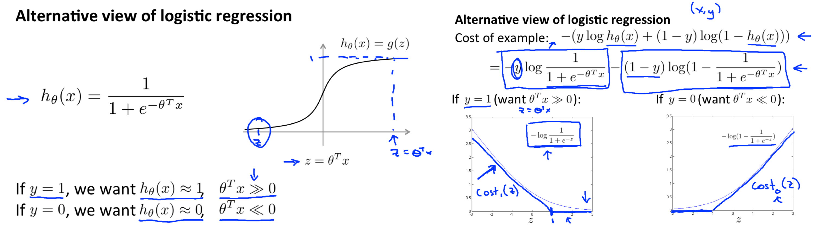
- Alternative view of logisc regression
- large margin classificaion

Note: - p. 333

----

#### Kernels

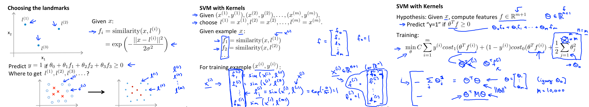

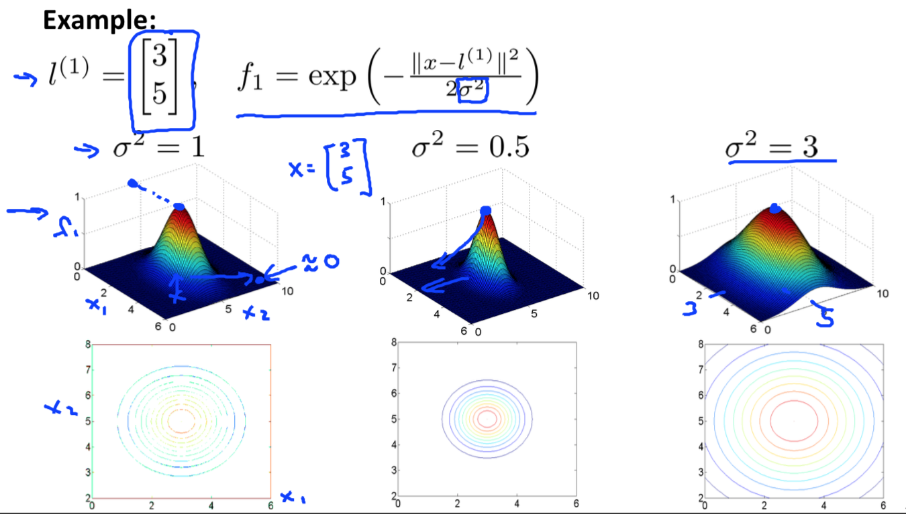

---

## Unsupervised Learning

- Organize computing clusters
- Social network analysis
- Market segmentation
- Astronomical data anlysis
- aka Clustering

Note: - Cocktail party problem (algorithim) audio

----

### k-means clustering

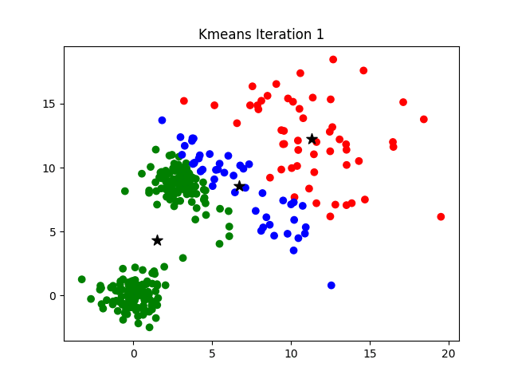

Examples:
 - T-shirt sizes (S, M, L, XL)

Note: p. 368, centroids

----

#### k-means clustering algorithm

**Input:**

- $K$ (number of clusters)
- Training set $\{x^{(1)},x^{(2)}...x^{(m)}\}$

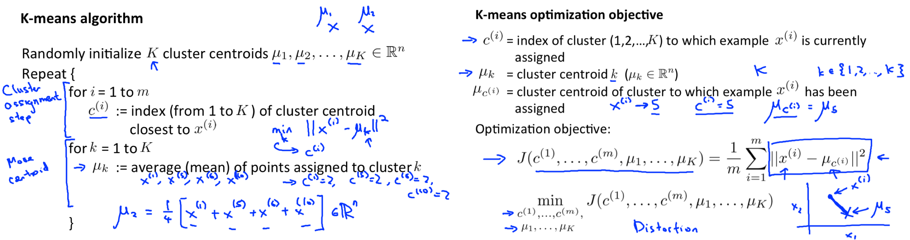

Note: $x^{(i)} \epsilon R^n$; choosing number of clusters via "Elbow" method; K < m!

---

#### Dimensionality Reduction: Principal Component Analysis (PCA)

 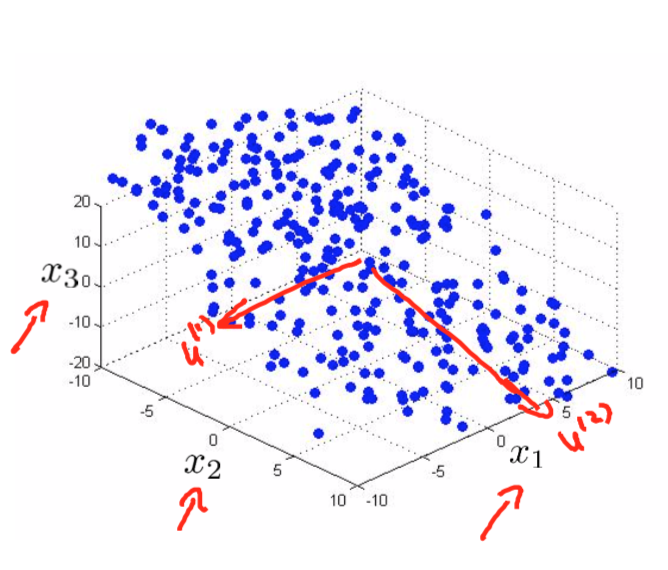

- Data compression (Reduce memory needed to store data)
- Speed up other learning algorithms
- Data visualization (reduce to 2D or 3D)

-> Reduce data from $n$-dimensions to $k$-dimensions

Note: p. 393, p. 401, project data into lower dimension, Reduce data from i.e. 2D to 1D, PCA is not linear regression

----

#### PCA - steps

1. Data preprocessing: feature scaling/mean normalization
2. Calculate covariance matrix <!--: 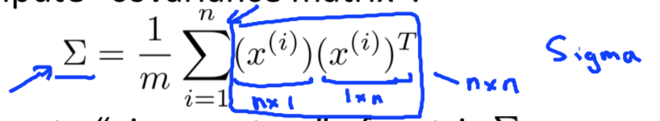-->
3. Compute eigenvectors of matrix Sigma    
	(`[U, _, _] = svd(Sigma);`)
4. `z = U' * x` where   
 	$x$ := original data   $z$ := dim. reduced data   
5. principal components $k$ (~ new axes in the data)
	Choose $k$ to be smallest value so that:
	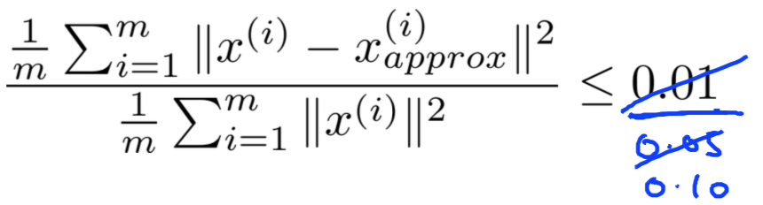
	
Note: 99% of variance is retained

----

### Anomaly Detection

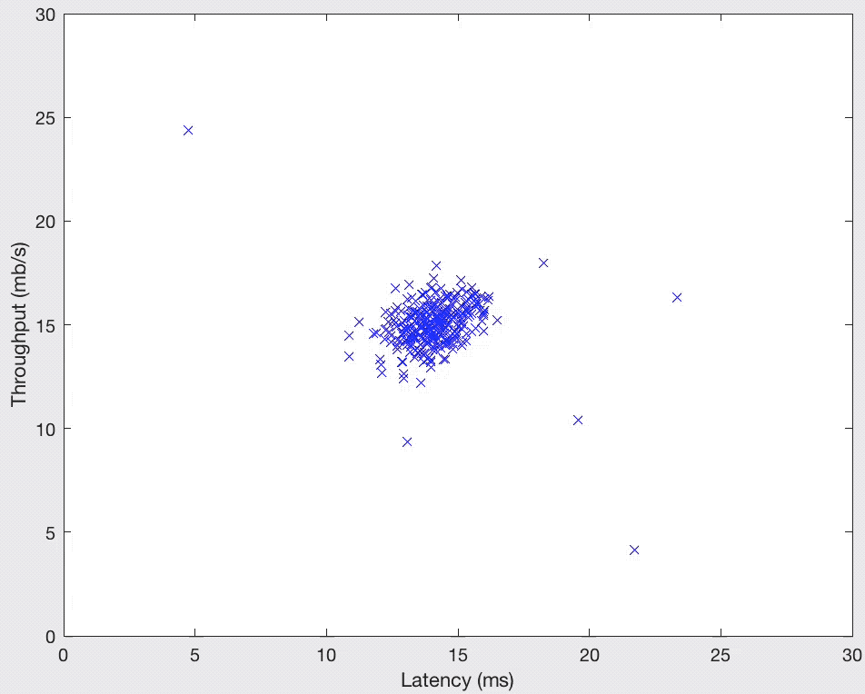

- Fraud detection
- Manufacturing (e.g. engines)
- Monitoring machines in data center

Note: p. 423

----

#### Anomaly Detection - Gaussian Distribution

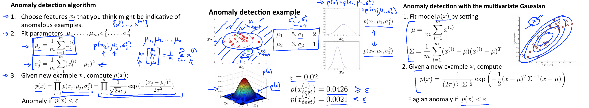

Note: use PCA to get features in lower dim space

---

### Recommender Systems

- predict movie ratings (netflix, hulu, ...)
- predict music by style (spotify radio, last.fm, pandora)
- predict products that customers would buy (amazon)

Note: p .461

----

#### Content-based filtering

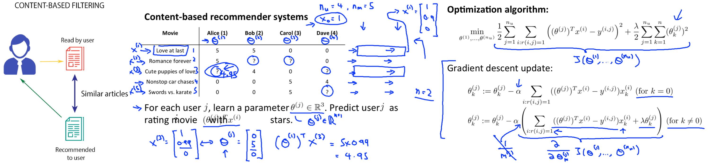

----

#### Collaborative filtering

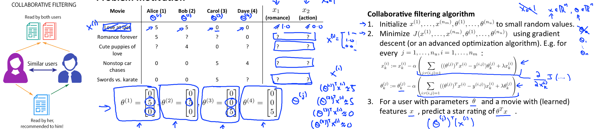

---

## Questions?

---

### Sources

- <https://www.coursera.org/learn/machine-learning>
- <https://en.wikipedia.org/wiki/Machine_learning>