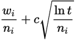

## Monte Carlo Method

### ... not the administrative area of the Principality of Monaco

  

Christian Treffs

----

### Monte Carlo methods or experiments

> ... broad class of computational algorithms that rely on *repeated random sampling* to obtain numerical results.

* Uses randomness to solve problems that might be deterministic in principle.
* Monte Carlo methods can be used to solve any problem having a probabilistic interpretation
* Method of **Reinforcement Learning**

Note: or experiments; probabilistic == based on or adapted to a theory of probability; subject to or involving chance variation: the main approaches are either rule-based or probabilistic.

----

### Monte Carlo Tree Search (MCTS)

* Is a probabilistic search algorithm.
* Effective in open-ended environments with an enormous amount of possibilities
* MCTS applies Monte Carlo method to the game tree search
* Does not need to brute force its way out of each possibility
* Does not necessarily require an evaluation or good heuristic function

Note: revolutionized the world of computer Go: March 2016; Google’s AlphaGo (built with MCTS and neural network) beat Lee Sedol (the world champion in Go).

----

### MCTS: Benefits

* Explores all potential options a that time
* Quickly identify the "best" one
* Keeps looking for other "good" options whilst validating how good the current best is
* Answer will typically improve the longer it has to "think" about it

Note: similar to MiniMax -> branching factor is high

----

##### MCTS: Phases

1. Selection
2. Expansion
3. Simulation
4. Backpropagation

Note: Backprop == Update

----

###### 1. Selection

* Start with a root node and select a child node such that the node has maximum win rate/score. 
* Make sure that each node is given a fair chance
* Keep selecting optimal child nodes until a leaf node of the tree is reached

Note: Takes the current state of the tree and selects decissions down that tree to a future state and affects depth

----

###### Selection Heuristic: Upper Confidence Bound Applied to Trees (UCT)

- $w_i$ = number of wins after the i-th move
- $n_i$ = number of simulations after the i-th move
- $c$ = exploration parameter (theoretically equal to √2)
- $t$ = total number of simulations for the parent node

Formula ensures that no state will be a victim of starvation and it also plays promising branches more often than their counterparts

----

###### 2. Expansion

* When it can no longer apply UCT to find the successor node, it expands the game tree by appending all possible states from the leaf node
* Move one step down to expose a new state in the tree, provided the state did not end the game either win or loss or exceeds the tree depth

----

###### 3. Simulation

* Algorithm picks a child node arbitrarily, and it simulates a randomized game from selected node until it reaches the resulting state of the game. 
* If nodes are picked randomly or semi-randomly during the play out, it is called light play out. 
* You can also opt for heavy play out by writing quality heuristics or evaluation functions.
* Playout provides a score.

----

###### 4. Backpropagation

* Also known as an update phase
* Once the algorithm reaches the end of the game, it evaluates the state to figure out which player has won
* It traverses upwards to the root and increments visit score for all visited nodes
* It also updates win score for each node if the player for that position has won the playout.

MCTS keeps repeating these four phases until some fixed number of iterations or some fixed amount of time.

Note: Update the states that lead to the state we updated.

----

##### Exploration vs. Exploitation trait-off

> Keep searching for new strategies while exploring the best strategiers found thus far

----

#### Video: AI of Total War: Rome II

<iframe width="560" height="315" src="https://www.youtube-nocookie.com/embed/1m9-7ZrpbBo?start=247" frameborder="0" allow="accelerometer; autoplay; encrypted-media; gyroscope; picture-in-picture" allowfullscreen></iframe>

<https://youtu.be/1m9-7ZrpbBo?t=246>

----

## Demo: Tic Tac Toe

----

###### Sources

- https://en.wikipedia.org/wiki/Monte_Carlo_method
- https://www.baeldung.com/java-monte-carlo-tree-search
- https://github.com/eugenp/tutorials/blob/master/algorithms-miscellaneous-1/
- https://www.analyticsvidhya.com/blog/2019/01/monte-carlo-tree-search-introduction-algorithm-deepmind-alphago/
- https://jeffbradberry.com/posts/2015/09/intro-to-monte-carlo-tree-search/
- https://github.com/brilee/python_uct
